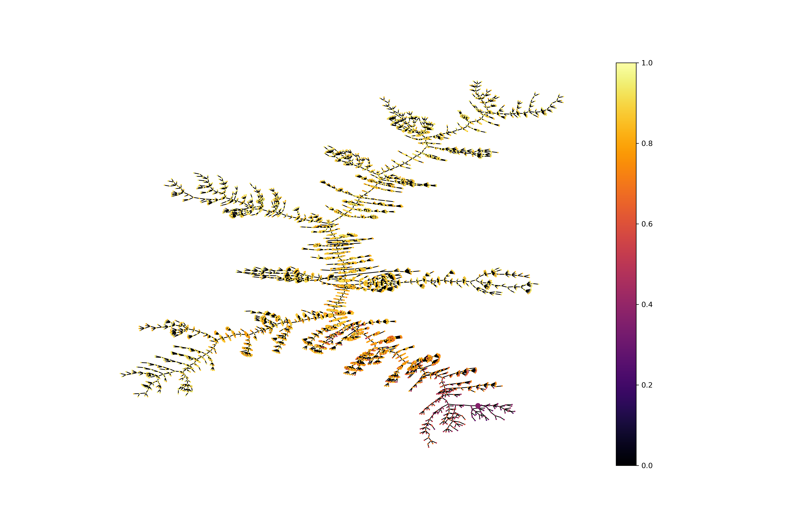

# EvoMol

[EvoMol](https://jcheminf.biomedcentral.com/articles/10.1186/s13321-020-00458-z#citeas) is a flexible and interpretable
evolutionary algorithm designed for molecular properties optimization. It can optimize any (customizable) objective
function. It can also maximize the
[diversity of generated molecules](https://jcheminf.biomedcentral.com/articles/10.1186/s13321-021-00554-8).

## Installation

EvoMol was designed on Ubuntu (18.04+). Some features might be missing on other systems. Especially, the drawing of
exploration trees is currently unavailable on Windows.

To install EvoMol on your system, run the appropriate commands in your terminal. The installation depends on
<a href='https://www.anaconda.com/products/individual'>Anaconda</a>.

### Linux

```shell script
$ git clone https://github.com/jules-leguy/EvoMol.git     # Clone EvoMol
$ cd EvoMol                                               # Move into EvoMol directory
$ conda env create -f evomol_env.yml                      # Create conda environment
$ conda activate evomolenv                                # Activate environment
$ python -m pip install .                                 # Install EvoMol
```

### Windows

```shell script
$ git clone https://github.com/jules-leguy/EvoMol.git     # Clone EvoMol
$ cd EvoMol                                               # Move into EvoMol directory
$ conda env create -f evomol_env_windows.yml              # Create conda environment
$ conda activate evomolenv                                # Activate environment
$ python -m pip install .                                 # Install EvoMol
```

## Quickstart

Launching a <a href="https://www.nature.com/articles/nchem.1243">QED</a> optimization for 500 steps. Beware, you need 
to activate the evomolenv2 conda environment when you use EvoMol.

```python
from evomol import run_model
run_model({
    "obj_function": "qed",
    "optimization_parameters": {
        "max_steps": 500
    },
    "io_parameters": {
        "model_path": "examples/1_qed"
    },
})
```

## Settings

A dictionary can be given to evomol.run_model to describe the experiment to be performed. This dictionary can contain up 
to 4 entries, that are described in this section.

**Default values** are represented in bold.

### Objective function

The ```"obj_function"``` attribute can take the following values. Multi-objective functions can be nested to any depth. 
* Implemented functions: 
  * "<a href="https://www.nature.com/articles/nchem.1243">qed</a>", 
 "<a href="https://arxiv.org/abs/1610.02415v2">plogp</a>", 
 "<a href="https://www.nature.com/articles/s41598-019-47148-x">norm_plogp</a>", 
 "<a href="https://jcheminf.biomedcentral.com/articles/10.1186/1758-2946-1-8">sascore</a>", 
 "<a href="https://arxiv.org/abs/1705.10843">norm_sascore</a>", 
 "<a href="https://www.frontiersin.org/articles/10.3389/fchem.2020.00046/full">clscore</a>".
  * "isomer_formula" (*e.g.* "isomer_C7H16").
  * "homo", "lumo", "gap", "homo-1"
  * "entropy_ifg", "entropy_gen_scaffolds", "entropy_shg_1" and "entropy_checkmol" can be used to maximize the entropy 
  of descriptors, 
   respectively using <a href="https://jcheminf.biomedcentral.com/articles/10.1186/s13321-017-0225-z">IFGs </a>, 
   <a href="https://pubs.acs.org/doi/10.1021/jm9602928">Murcko generic scaffolds</a>, level 1 
   <a href="https://link.springer.com/article/10.1186/s13321-018-0321-8">shingles</a> and 
   <a href="https://homepage.univie.ac.at/norbert.haider/cheminf/cmmm.html">checkmol</a>.
  * "n_perturbations": count of the number of perturbations that were previously applied on the molecular graph during 
the optimization. If the "mutation_max_depth" parameter is set to 1, then this is equivalent to the number of mutations.
* A custom function evaluating a SMILES. It is also possible to give a tuple (function, string function name).
* A dictionary describing a multi-objective function and containing the following entries (see the [example section](https://github.com/jules-leguy/EvoMol#Designing-complex-objective-functions)).
    * ```"type"``` : 
      * "linear_combination" (linear combination of the properties).
      * "product" (product of the properties).
      * "mean" (mean of the properties).
    * ```"functions"``` : list of functions (string keys describing implemented functions, custom functions,
    multi-objective functions or wrapper functions).
    * Specific to the linear combination
        * ```"coef"``` : list of coefficients.
* A dictionary describing a function wrapping a single property and containing the following entries (see the [example section](https://github.com/jules-leguy/EvoMol#Designing-complex-objective-functions)).
  * ```"type"```:
     * "gaussian" (passing the value of a unique objective function through a Gaussian function).
     * "opposite" (computing the opposite value of a unique objective function).
     * "sigm_lin", (passing the value of a unique objective through a linear function and a sigmoid function).
     * "one_minus" (computing 1-f(x) of a unique objective function f).
  * ```"function"``` the function to be wrapped (string key describing an implemented function, custom function,
  multi_objective function or wrapper function). For compatibility reasons, it is also possible to use a 
  ```"functions"``` attribute that contains a list of functions. In that case only the first element of the list is
  considered.
  * Specific to the use of a Gaussian function
    * ```"mu"```: μ parameter of the Gaussian.
    * ```"sigma"```: σ parameter of the Gaussian.
    * ```"normalize"```: whether to normalize the function so that the maximum value is exactly 1 (**False**).
  * Specific to the use of sigmoid/linear functions
      * ```"a"``` list of *a* coefficients for the *ax+b* linear function definition.
      * ```"b"``` list of *b* coefficients for the *ax+b* linear function definition.
      * ```"lambda"``` list of *λ* coefficients for the sigmoid function definition.
* An instance of evomol.evaluation.EvaluationStrategyComposant
* ```"guacamol_v2"``` for taking the goal directed <a href="https://pubs.acs.org/doi/10.1021/acs.jcim.8b00839">
GuacaMol</a> benchmarks.


### Search space

The ```"action_space_parameters"``` attribute can be set with a dictionary containing the following entries.
* ```"atoms"``` : text list of available <ins>heavy</ins> atoms (**"C,N,O,F,P,S,Cl,Br"**).
* ```"max_heavy_atoms"```: maximum molecular size in terms of number of heavy atoms (**38**).
* ```"append_atom"```: whether to use *append atom* action (**True**).
* ```"remove_atom"```: whether to use *remove atom* action (**True**).
* ```"change_bond"```: whether to use *change bond* action (**True**).
* ```"change_bond_prevent_breaking_creating_bonds"```: whether to prevent the removal or creation of bonds by *change_bond* action (**False**) 
* ```"substitution"```: whether to use *substitute atom type* action (**True**).
* ```"cut_insert"```: whether to use *cut atom* and *insert carbon atom* actions (**True**).
* ```"move_group"```: whether to use *move group* action (**True**).
* ```"remove_group"```: whether to use *remove group* action (**False**).
* ```"remove_group_only_remove_smallest_group"```: in case remove group action is enabled, whether to be able to remove 
* both parts of a bridge bond (False), or only the smallest part in number of atoms (**True**).
* ```"use_rd_filters"```: whether to use the <a href=https://github.com/PatWalters/rd_filters>rd_filter program</a> as a 
quality filter before inserting the mutated individuals in the population (**False**).
* ```"sillywalks_threshold``` maximum proportion of [silly bits](https://github.com/PatWalters/silly_walks) in the ECFP4 
fingerprint of the solutions with respect to a reference dataset (see IO parameters). If the proportion is above the
threshold, the solutions will be discarded and thus will not be inserted in the population (**1**).
* ```"sascore_threshold"``` if the solutions have a [SAScore](https://jcheminf.biomedcentral.com/articles/10.1186/1758-2946-1-8)
value above this threshold, they will be discarded and thus will not be inserted in the population (**float("inf")**).
* ```"sulfur_valence"```: valence of sulfur atoms (**6**).

### Optimization parameters

The ```"optimization_parameters"``` attribute can be set with a dictionary containing the following entries.
* ```"pop_max_size"``` : maximum population size (**1000**).
* ```"max_steps"``` : number of steps to be run before stopping EvoMol (**1500**).
* ```"max_obj_calls""```: number of calls to the objective functions before stopping EvoMol (**float("inf")**).
* ```"stop_kth_score_value"```: stopping the search if the kth score in descendant value order has reached the given 
value with given precision. Accepts a tuple (k, score, precision) or **None** to disable.
* ```"k_to_replace"``` : number of individuals replaced at each step (**10**).
* ```"selection"``` : whether the best individuals are selected to be mutated (**"best"**), or they are selected 
randomly with uniform distribution ("random"), or they are selected randomly with a probability that is proportional
to their objective function value ("random_weighted") .
* ```"problem_type"``` : whether it is a maximization (**"max"**) or minimization ("min") problem.
* ```"mutation_max_depth"``` : maximum number of successive actions on the molecular graph during a single mutation 
(**2**).
* ```"mutation_find_improver_tries"``` : maximum number of mutations to find an improver (**50**).
* ```"guacamol_init_top_100"``` : whether to initialize the population with the 100 best scoring individuals of the 
GuacaMol <a href="https://academic.oup.com/nar/article/45/D1/D945/2605707">ChEMBL</a> subset in case of taking the 
GuacaMol benchmarks (**False**). The list of SMILES must be given as initial population.
* ```"mutable_init_pop"``` : if True, the individuals of the initial population can be freely mutated. If False, they 
can be branched but their atoms and bonds cannot be modified (**True**).
* ```"n_max_desc"```: max number of descriptors to be possibly handled when using an evaluator relying on a vector of 
descriptors such as entropy contribution (**3.000.000**).
* ```"shuffle_init_pop"```: whether to shuffle the smiles at initialization (**False**).

### Input/Output parameters

The ```"io_parameters"``` attribute can be set with a dictionary containing the following entries.
* ```"model_path"``` : path where to save model's output data (**"EvoMol_model"**).
* ```"smiles_list_init"```: list of SMILES describing the initial population (**None**: interpreting the 
```"smiles_list_init_path"``` attribute). Note : not available when taking GuacaMol benchmarks.
* ```"smiles_list_init_path"``` : path where to find the SMILES list text file describing the initial population 
(**None**: initialization of the population with a single methane molecule).
* ```"external_tabu_list"```: list of SMILES that won't be generated by EvoMol.
* ```"record_history"``` : whether to save exploration tree data. Must be set to True to later draw the exploration tree
 (**False**).
* ```"record_all_generated_individuals"``` : whether to record a list of all individuals that are generated during the 
entire execution (even if they fail the objective function computation or if they are not inserted in the population as
they are not improvers). Also recording the step number and the total number of calls to the objective function at the 
time of generation (**False**).
* ```"save_n_steps"``` : period (steps) of saving the data (**100**).
* ```"print_n_steps"``` : period (steps) of printing current population statistics (**1**).
* ```"dft_working_dir"``` : path where to save DFT optimization related files (**"/tmp"**).
* ```"dft_cache_files"``` : list of json files containing a cache of previously computed HOMO or LUMO values (**[]**).
* ```"dft_MM_program"``` : program used to compute molecular mechanics initial geometry of DFT calculations. The 
options are :
  * "**obabel_mmff94**" or "obabel" to combine OpenBabel and the MMFF94 force field.
  * "rdkit_mmff94" to combine RDKit with the MMFF94 force field.
  * "rdkit_uff" to combine RDKit with the UFF force field.
* ```"dft_base"```: DFT calculations base (__"3-21G*"__).
* ```"silly_molecules_reference_db_path``` : path to a JSON file that represents a dictionary containing as keys all the
ECFP4 bits that are extracted from a reference dataset of quality solutions (**None**). See the 
```"sillywalks_threshold"``` parameter.
* ```"evaluation_strategy_parameters"``` : a dictionary that contains an entry "evaluate_init_pop" to set given 
parameters to the EvaluationStrategy instance in the context of the evaluation of the initial population. An entry
 "evaluate_new_sol" must be also contained to set given parameters for the evaluation of new solutions during the 
 optimization process. If None, both keys are set to an empty set of parameters (**None**).

## Examples

### Designing complex objective functions

In order to aggregate several objective functions into a single function that will be optimized by EvoMol, it is
neccessary to use the dictionary (tree) function declaration for the ```"obj_function"``` attribute.

As an example, we design here an objective function to solve a virtual problem. The problem is to find a molecule
with a QED value of about 0.8, a CLScore value above 4, and about 70% of carbon atoms (ignoring the hydrogen atoms).

First, we design a function that counts the proportion of heteroatoms. 

```python
from rdkit.Chem import Lipinski, MolFromSmiles

def hetero_atoms_proportion(smiles):
    return Lipinski.NumHeteroatoms(MolFromSmiles(smiles)) / Lipinski.HeavyAtomCount(MolFromSmiles(smiles))
```

Then, the objective function can be designed this way. We consider that the most important property here is the QED 
value (coefficient 0.5) and that the two other properties are equally important (coefficient 0.25). The sum of the
coefficients may be different from 1, but since all the functions range between 0 and 1 here, this allows the final
function to also range between 0 and 1.

```python
objective_tree = {
    # The objective function is a linear combination of three sub-functions
    "type": "linear_combination",
    "coef": [0.5, 0.25, 0.25],
    "functions": [
        { 
            # Centering a Gaussian function on the 0.8 QED value
            "type": "gaussian",
            "function": "qed",
            "mu": 0.8,
            "sigma": 0.5, 
            "normalize": True
        },
        {   
            # The parameters of the sigmoid function are chosen so that the function value is above 0.99 when the CLScore value is above 4
            "type": "sigm_lin",
            "function": "clscore",
            "a": -1,
            "b": 3.5, 
            "lambda": 10
        },
        {
            # Centering a Gaussian function on the 0.7 proportion of hetero atoms
            "type": "gaussian",
            "function": {
                # Returning 1 - (proportion of heteroatoms) to represent the proportion of carbon atoms
                "type": "one_minus",
                "function": (hetero_atoms_proportion, "hetero_atoms_proportion")
            },
            "mu": 0.7,
            "sigma": 0.5, 
            "normalize": True
        },
    ]
}
```

The designed objective function can then be optimized by calling the run_model function of EvoMol

```python
from evomol import run_model

run_model({
    "obj_function": objective_tree,
    "io_parameters": {
        "model_path": "examples/multiobjective_run"
    }
})
```


### Drawing exploration trees

#### Large exploration tree

Performing a <a href="https://www.nature.com/articles/nchem.1243">QED</a> optimization run of 500 steps, while 
recording the exploration data. 

```python
from evomol import run_model

model_path = "examples/2_large_tree"

run_model({
    "obj_function": "qed",
    "optimization_parameters": {
        "max_steps": 500},
    "io_parameters": {
        "model_path": model_path,
        "record_history": True
    }
})
```

Plotting the exploration tree with solutions colored according to their score. Nodes represent solutions. Edges 
represent mutations that lead to an improvement in the population.

```python
from evomol.plot_exploration import exploration_graph
exploration_graph(model_path=model_path, layout="neato")
```


#### Detailed exploration tree

Performing the experiment of mutating a fixed core of acetylsalicylic acid to increase its 
<a href="https://www.nature.com/articles/nchem.1243">QED</a> value. 

```python
from evomol import run_model

model_path = "examples/3_detailed_tree"

run_model({
    "obj_function": "qed",
    "optimization_parameters": {
        "max_steps": 10,
        "pop_max_size": 10,
        "k_to_replace": 2,
        "mutable_init_pop": False
    },
    "io_parameters": {
        "model_path": model_path,
        "record_history": True,
        "smiles_list_init_path": "examples/acetylsalicylic_acid.smi"
    }
})
```

Plotting the exploration tree including molecular drawings, scores and action types performed during mutations.
Also plotting a table of molecular drawings.

```python
from evomol.plot_exploration import exploration_graph

exploration_graph(model_path=model_path, layout="dot", draw_actions=True, plot_images=True, draw_scores=True,
                  root_node="O=C(C)Oc1ccccc1C(=O)O", legend_scores_keys_strat=["total"], mol_size=0.3,
                  legend_offset=(-0.007, -0.05), figsize=(20, 20/1.5), legends_font_size=13)
```


<p align="center">

</p>

### Entropy and multi-objective optimization

Optimizing jointly the <a href="https://www.nature.com/articles/nchem.1243">QED</a> and the entropy of 
<a href="https://jcheminf.biomedcentral.com/articles/10.1186/s13321-017-0225-z">IFGs</a> using a linear combination. The
weights are set respectively to 1 and 10.

```python
from evomol import run_model

model_path = "examples/4_entropy_optimization"

run_model({
    "obj_function": {
        "type": "linear_combination",
        "functions": ["qed", "entropy_ifg"],
        "coef": [1, 10]
    },
    "optimization_parameters": {
        "max_steps": 500,
        "pop_max_size": 1000
    },
    "io_parameters": {
        "model_path": model_path,
        "record_history": True
    },
})
```

Plotting the exploration trees representing the QED values.

```python
from evomol.plot_exploration import exploration_graph
exploration_graph(model_path=model_path, layout="neato", prop_to_study_key="qed")
```




## Environment variables and data requirements

### CLscore

As the <a href="https://www.frontiersin.org/articles/10.3389/fchem.2020.00046/full"> CLscore </a> is dependent of prior 
data to be computed, EvoMol needs to be given the data location.
To do so, the ```$SHINGLE_LIBS``` environment variable must be set to the location of the shingle_libs folder that can
be downloaded <a href="https://github.com/reymond-group/GDBChEMBL"> here</a>.
 
### DFT optimization

To perform DFT computations, you need to bind <a href="https://gaussian.com/glossary/g09/">Gaussian09</a> or another 
version of Gaussian with EvoMol.

To do so, the ```$OPT_LIBS``` environment variable must point to a folder containing ```run.sh```, a script launching a 
DFT optimization with Gaussian09 of the input filepath given as parameter.

Here is an example of such a file.

```shell
#!/usr/bin/env bash

export g09root=/path/to/the/folder/that/contains/g09/installation/folder
source g09root/g09/bsd/g09.profile

g09 $1 $2
```

### Checkmol descriptor

In order to use the checkmol descriptor for entropy evaluation, the ```$CHECKMOL_EXE``` environment variable must point 
to the executable of the 
<a href="https://homepage.univie.ac.at/norbert.haider/download/chemistry/checkmol/checkmol.pas">checkmol program</a>.

OpenBabel must also be installed (see above section).

### GuacaMol initial population

To use EvoMol for <a href="https://pubs.acs.org/doi/10.1021/acs.jcim.8b00839">GuacaMol</a> goal directed benchmarks 
optimization using the best scoring molecules from their subset of 
<a href="https://academic.oup.com/nar/article/45/D1/D945/2605707">ChEMBL</a> as initial population, you need to :
* Download the <a href="https://figshare.com/projects/GuacaMol/56639">ChEMBL subset</a>.
* Give the path of the data using the ```"smiles_list_init_path"``` attribute.
* Insure that the ```"guacamol_init_top_100"``` attribute is set to True.

### rd_filters
To use the <a href=https://github.com/PatWalters/rd_filters>rd_filter program</a> as a filter of solutions that can be 
inserted in the population, the ```$FILTER_RULES_DATA``` environment variable must point to a folder containing the 
```rules.json``` and ```alert_collection.csv``` files.

## Citing EvoMol

To reference EvoMol, please cite one of the following articles.

Leguy, J., Cauchy, T., Glavatskikh, M., Duval, B., Da Mota, B. EvoMol: a flexible and interpretable evolutionary 
algorithm for unbiased de novo molecular generation. J Cheminform 12, 55 (2020). 
https://doi.org/10.1186/s13321-020-00458-z

Leguy, J., Glavatskikh, M., Cauchy, T. et al. Scalable estimator of the diversity for de novo molecular 
generation resulting in a more robust QM dataset (OD9) and a more efficient molecular optimization. 
J Cheminform 13, 76 (2021). https://doi.org/10.1186/s13321-021-00554-8