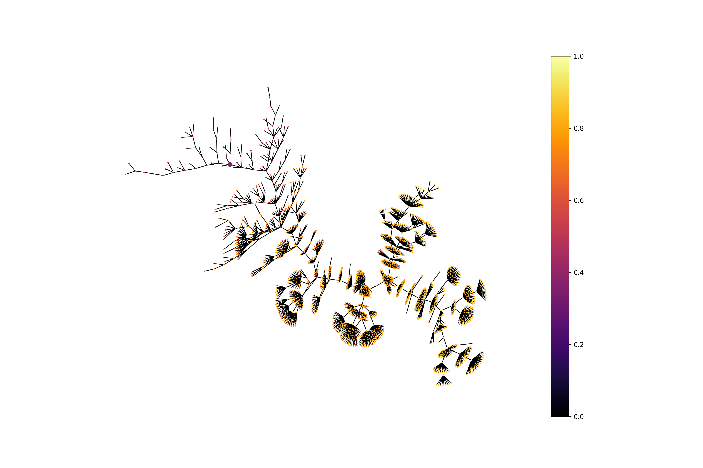

# EvoMol

## Install

To install EvoMol, run the following commands in your terminal.

```bash
$ git clone https://github.com/jules-leguy/EvoMol.git     # Clone EvoMol
$ cd EvoMol                                               # Move into EvoMol directory
$ conda env create -f evomol_env.yml                      # Create conda environment
$ conda activate evomolenv                                # Activate environment
$ conda install -c conda-forge rdkit                      # Install RDKit using conda-forge
$ pip install .                                           # Instal EvoMol
```


## Quickstart

Launching a QED optimization for 500 steps. Beware, you need to activate the evomolenv conda environment when you use EvoMol.

```python
from evomol import run_model
run_model({
    "obj_function": "qed",
    "optimization_parameters": {
        "max_steps": 500
    },
    "io_parameters": {
        "model_path": "examples/1_qed"
    },
})
```

## Model parametrization

To run a model, you need to pass a dictionary describing the run to the run_model function. This dictionary can have up to 4 entries that are described in this section.

**Default values** are represented in bold.

### Objective function

The ```"obj_function"``` attribute can take the following values.
* Implemented functions (see article) : "qed", "plogp", "norm_plogp", "sascore", "norm_sascore", "clscore", "homo", "lumo".
* A custom function evaluating a SMILES.
* A dictonary describing a multiobjective function containing the following entries.
    * ```"type"``` : "linear_combination" (linear combination of the properties) or "product_sigm_lin" (product of the properties after passing a linear function and a sigmoid function).
    * ```"functions"``` : list of functions (string keys describing implemented functions or custom functions).
    * Specific to the linear combination.
        * ```"coef"``` : list of coefficients.
    * Specific to the product of sigmoid/linear functions
        * ```"a"``` list of *a* coefficients for the *ax+b* linear function definition.
        * ```"b"``` list of *b* coefficients for the *ax+b* linear function definition.
        * ```"lambda"``` list of *λ* coefficients for the sigmoid function definition.
* ```"guacamol"``` for taking the goal directed GuacaMol benchmarks (https://pubs.acs.org/doi/10.1021/acs.jcim.8b00839).


### Search space

The ```"action_space_parameters"``` attribute can be set with a dictionary containing the following entries.
* ```"atoms"``` : text list of available heavy atoms (**"C,N,O,F,P,S,Cl,Br"**).
* ```"max_heavy_atoms"```: maximum molecular size in terms of number of heavy atoms (**38**).
* ```"substitution"```: whether to use *substitute atom type* action (**True**).
* ```"cut_insert"```: whether to use *cut atom* and *insert carbon atom* actions (**True**).
* ```"move_group"```: whether to use *move group* action (**True**).

### Optimization parameters

The ```"optimization_parameters"``` attribute can be set with a dictionary containing the following entries.
* ```"pop_max_size"``` : maximum population size (**1000**).
* ```"max_steps"``` : number of steps to be run (**1500**).
* ```"k_to_replace"``` : number of individuals replaced at each step (**2**).
* ```"problem_type"``` : whether it is a maximization (**"max"**) or minimization ("min") problem.
* ```"max_steps"``` : number of steps to be run (**1500**).
* ```"mutation_max_depth"``` : maximum number of successive actions on the molecular graph during a single mutation (**2**).
* ```"mutation_find_improver_tries"``` : maximum number of mutations to find an improver (**50**).
* ```"guacamol_init_top_100"``` : whether to initialize the population with the 100 best scoring individuals of the GuacaMol ChEMBL subset in case of taking the GuacaMol benchmarks (**True**). The list of SMILES must be given as initial population.
* ```"mutable_init_pop"``` : if True, the individuals of the initial population can be freely mutated. If False, they can be branched but their atoms and bonds cannot be modified. (**True**).

### Input/Output parameters

The ```"io_parameters"``` attribute can be set with a dictionary containing the following entries.
* ```"model_path"``` : path where to save model's output data (**"EvoMol_model"**).
* ```"smiles_list_init_path"``` : path where to find the SMILES list describing the initial population (**None**: initialization of the population with a single methane molecule).
* ```"record_history"``` : whether to save exploration tree data. Must be set to True to further draw the exploration tree (**False**).
* ```"save_n_steps"``` : frequency (steps) of saving the data (**100**).
* ```"print_n_steps"``` : frequency (steps) of printing current population statistics (**1**).
* ```"dft_working_dir"``` : path where to save DFT optimization related files (**"/tmp"**).
* ```"dft_cache_files"``` : list of json files containing a cache of previously computed HOMO or LUMO values (**[]**).

## Drawing exploration trees

### Large exploration tree

```python
from evomol import run_model
from evomol.plot_exploration import exploration_graph

model_path = "examples/2_large_exploration_tree"

run_model({
    "obj_function": "qed",
    "optimization_parameters": {
        "max_steps": 150},
    "io_parameters": {
        "model_path": model_path,
        "record_history": True
    }
})

exploration_graph(model_path=model_path, layout="neato")


```