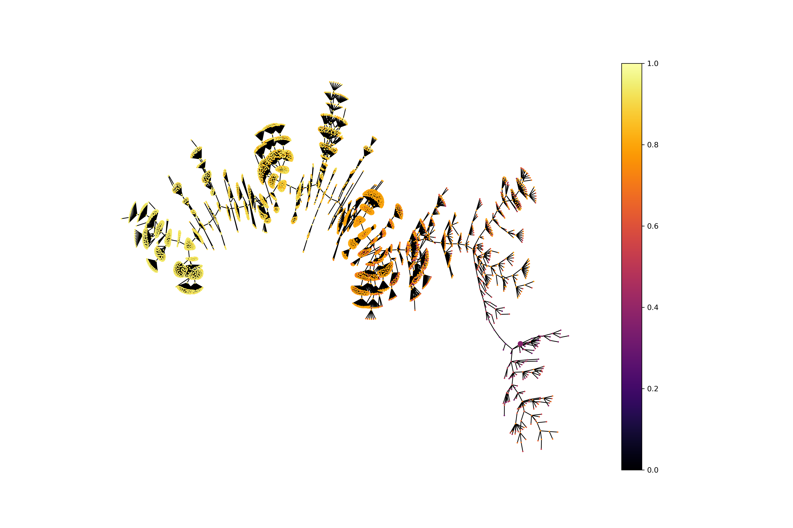
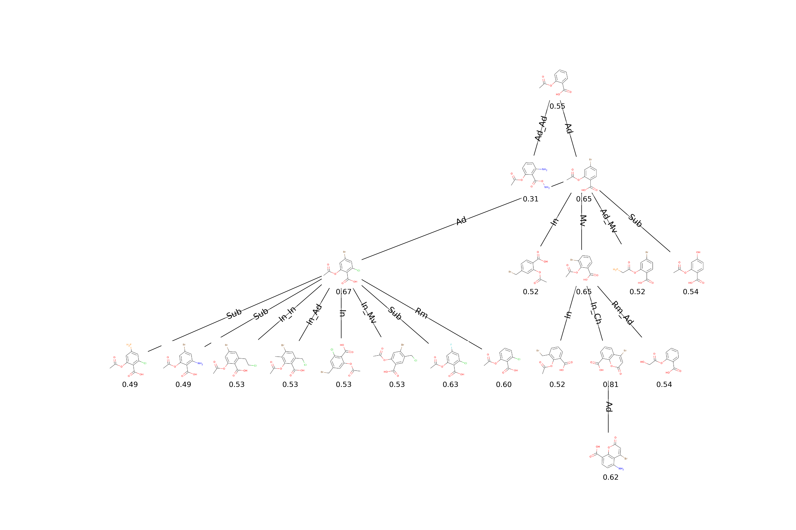
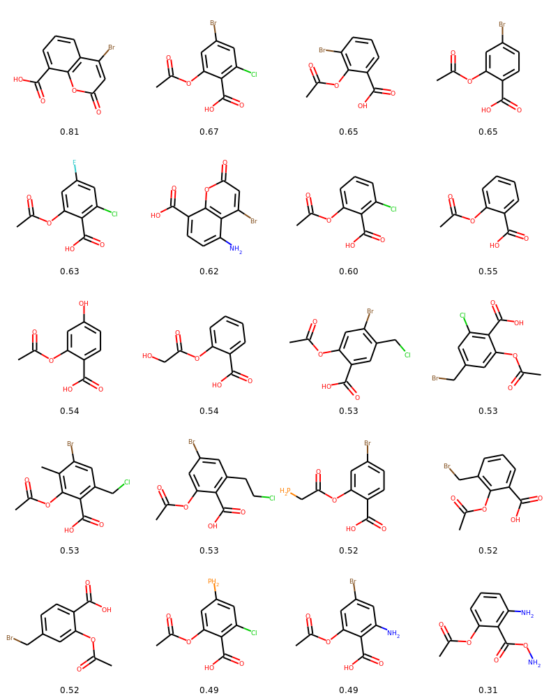

# EvoMol

test

## Installation

EvoMol has been designed on Ubuntu (18.04+). Some features might be missing on other systems. Especially, the drawing of exploration trees is currently unavailable on Windows.


To install EvoMol on your system, run the appropriate commands in your terminal. The installation depends on <a href='https://www.anaconda.com/products/individual'>Anaconda</a>.

### Linux

```shell script
$ git clone https://github.com/jules-leguy/EvoMol.git     # Clone EvoMol
$ cd EvoMol                                               # Move into EvoMol directory
$ conda env create -f evomol_env.yml                      # Create conda environment
$ conda activate evomolenv                                # Activate environment
$ python -m pip install .                                 # Install EvoMol
```

### Windows

```shell script
$ git clone https://github.com/jules-leguy/EvoMol.git     # Clone EvoMol
$ cd EvoMol                                               # Move into EvoMol directory
$ conda env create -f evomol_env_windows.yml              # Create conda environment
$ conda activate evomolenv                                # Activate environment
$ python -m pip install .                                 # Install EvoMol
```


## Quickstart

Launching a <a href="https://www.nature.com/articles/nchem.1243">QED</a> optimization for 500 steps. Make sure to activate the evomolenv conda environment when you use EvoMol.

```python
from evomol import run_model
run_model({
    "obj_function": "qed",
    "optimization_parameters": {
        "max_steps": 500
    },
    "io_parameters": {
        "model_path": "examples/1_qed"
    },
})
```

## Model parametrization

To run a model, you need to pass a dictionary describing the run to the run_model function. This dictionary can have up 
to 4 entries that are described in this section.

**Default values** are represented in bold.

### Objective function

The ```"obj_function"``` attribute can take the following values.
* Implemented functions (see article) : "<a href="https://www.nature.com/articles/nchem.1243">qed</a>", 
 "<a href="https://arxiv.org/abs/1610.02415v2">plogp</a>", 
 "<a href="https://www.nature.com/articles/s41598-019-47148-x">norm_plogp</a>", 
 "<a href="https://jcheminf.biomedcentral.com/articles/10.1186/1758-2946-1-8">sascore</a>", 
 "<a href="https://arxiv.org/abs/1705.10843">norm_sascore</a>", 
 "<a href="https://www.frontiersin.org/articles/10.3389/fchem.2020.00046/full">clscore</a>", "homo", "lumo".
* A custom function evaluating a SMILES.
* A dictonary describing a multiobjective function containing the following entries.
    * ```"type"``` : "linear_combination" (linear combination of the properties) or "product_sigm_lin" (product of the properties after passing a linear function and a sigmoid function).
    * ```"functions"``` : list of functions (string keys describing implemented functions or custom functions).
    * Specific to the linear combination.
        * ```"coef"``` : list of coefficients.
    * Specific to the product of sigmoid/linear functions
        * ```"a"``` list of *a* coefficients for the *ax+b* linear function definition.
        * ```"b"``` list of *b* coefficients for the *ax+b* linear function definition.
        * ```"lambda"``` list of *λ* coefficients for the sigmoid function definition.
* ```"guacamol"``` for taking the goal directed <a href="https://pubs.acs.org/doi/10.1021/acs.jcim.8b00839">GuacaMol</a>
 benchmarks.


### Search space

The ```"action_space_parameters"``` attribute can be set with a dictionary containing the following entries.
* ```"atoms"``` : text list of available heavy atoms (**"C,N,O,F,P,S,Cl,Br"**).
* ```"max_heavy_atoms"```: maximum molecular size in terms of number of heavy atoms (**38**).
* ```"substitution"```: whether to use *substitute atom type* action (**True**).
* ```"cut_insert"```: whether to use *cut atom* and *insert carbon atom* actions (**True**).
* ```"move_group"```: whether to use *move group* action (**True**).

### Optimization parameters

The ```"optimization_parameters"``` attribute can be set with a dictionary containing the following entries.
* ```"pop_max_size"``` : maximum population size (**1000**).
* ```"max_steps"``` : number of steps to be run (**1500**).
* ```"k_to_replace"``` : number of individuals replaced at each step (**2**).
* ```"problem_type"``` : whether it is a maximization (**"max"**) or minimization ("min") problem.
* ```"max_steps"``` : number of steps to be run (**1500**).
* ```"mutation_max_depth"``` : maximum number of successive actions on the molecular graph during a single mutation (**2**).
* ```"mutation_find_improver_tries"``` : maximum number of mutations to find an improver (**50**).
* ```"guacamol_init_top_100"``` : whether to initialize the population with the 100 best scoring individuals of the GuacaMol <a href="https://academic.oup.com/nar/article/45/D1/D945/2605707">ChEMBL</a> subset in case of taking the GuacaMol benchmarks (**True**). The list of SMILES must be given as initial population.
* ```"mutable_init_pop"``` : if True, the individuals of the initial population can be freely mutated. If False, they can be branched but their atoms and bonds cannot be modified (**True**).

### Input/Output parameters

The ```"io_parameters"``` attribute can be set with a dictionary containing the following entries.
* ```"model_path"``` : path where to save model's output data (**"EvoMol_model"**).
* ```"smiles_list_init_path"``` : path where to find the SMILES list describing the initial population (**None**: initialization of the population with a single methane molecule).
* ```"record_history"``` : whether to save exploration tree data. Must be set to True to further draw the exploration tree (**False**).
* ```"save_n_steps"``` : frequency (steps) of saving the data (**100**).
* ```"print_n_steps"``` : frequency (steps) of printing current population statistics (**1**).
* ```"dft_working_dir"``` : path where to save DFT optimization related files (**"/tmp"**).
* ```"dft_cache_files"``` : list of json files containing a cache of previously computed HOMO or LUMO values (**[]**).

## Drawing exploration trees

### Large exploration tree

Performing a <a href="https://www.nature.com/articles/nchem.1243">QED</a> optimization run of 500 steps, while 
recording the exploration data. 

```python
from evomol import run_model

model_path = "examples/2_large_tree"

run_model({
    "obj_function": "qed",
    "optimization_parameters": {
        "max_steps": 500},
    "io_parameters": {
        "model_path": model_path,
        "record_history": True
    }
})
```

Plotting the exploration tree with solutions colored according to their score. Nodes represent solutions. Edges 
represent mutations that lead to an improvement in the population.

```python
from evomol.plot_exploration import exploration_graph
exploration_graph(model_path=model_path, layout="neato")
```



### Detailed exploration tree

Performing the experiment of mutating a fixed core of acetylsalicylic acid to increase its 
<a href="https://www.nature.com/articles/nchem.1243">QED</a> value. 

```python
from evomol import run_model

model_path = "examples/3_detailed_tree"

run_model({
    "obj_function": "qed",
    "optimization_parameters": {
        "max_steps": 10,
        "pop_max_size": 10,
        "k_to_replace": 2,
        "mutable_init_pop": False
    },
    "io_parameters": {
        "model_path": model_path,
        "record_history": True,
        "smiles_list_init_path": "examples/acetylsalicylic_acid.smi"
    }
})
```

Plotting the exploration tree including molecular drawings, scores and action types performed during mutations.
Also plotting a table of molecular drawings.

```python
from evomol.plot_exploration import exploration_graph

exploration_graph(model_path=model_path, layout="dot", draw_actions=True, plot_images=True, draw_scores=True,
                  root_node="O=C(C)Oc1ccccc1C(=O)O", legend_scores_keys_strat=["total"], mol_size=0.3,
                  legend_offset=(-0.007, -0.05), figsize=(20, 20/1.5), legends_font_size=13)
```



<p align="center">

</p>

## Environment variables and data requirements

### CLscore

As the <a href="https://www.frontiersin.org/articles/10.3389/fchem.2020.00046/full"> CLscore </a> is dependent of prior 
data to be computed, EvoMol needs to be given the data location.
To do so, the ```$SHINGLE_LIBS``` environment variable must be set to the location of the shingle_libs folder that can
be downloaded <a href="https://github.com/reymond-group/GDBChEMBL"> here</a>.
 
### DFT and Molecular Mechanics optimization

To perform DFT and Molecular Mechanics computation (necessary for HOMO and LUMO optimization), you need to bind 
<a href="https://gaussian.com/glossary/g09/">Gaussian09</a> and 
<a href="https://jcheminf.biomedcentral.com/articles/10.1186/s13321-019-0372-5">OpenBabel</a> with EvoMol.

To do so, the ```$OPT_LIBS``` variable must point to a folder containing : 
* run.sh : a script launching a DFT optimization with Gaussian09 of the input filepath given as parameter.
* obabel/openbabel-2.4.1 : directory containing an installation of OpenBabel 2.4.1. Make sure to also set OpenBabel's
```$BABEL_DATADIR``` environment variable to ```$OPT_LIBS/obabel/openbabel-2.4.1/data```.

To install OpenBabel, you should compile <a href='https://github.com/openbabel/openbabel/releases/tag/openbabel-2-4-1'> the sources </a> using the <a href='https://open-babel.readthedocs.io/en/latest/Installation/install.html#compiling-open-babel'>official instructions</a>.

### GuacaMol initial population

To use EvoMol for <a href="https://pubs.acs.org/doi/10.1021/acs.jcim.8b00839">GuacaMol</a> goal directed benchmarks 
optimization using the best scoring molecules from their subset of 
<a href="https://academic.oup.com/nar/article/45/D1/D945/2605707">ChEMBL</a> as initial population, you need to :
* Download the <a href="https://figshare.com/projects/GuacaMol/56639">ChEMBL subset</a>.
* Give the path of the data using the ```"smiles_list_init_path"``` attribute.
* Insure that the ```"guacamol_init_top_100"``` attribute is set to True.
